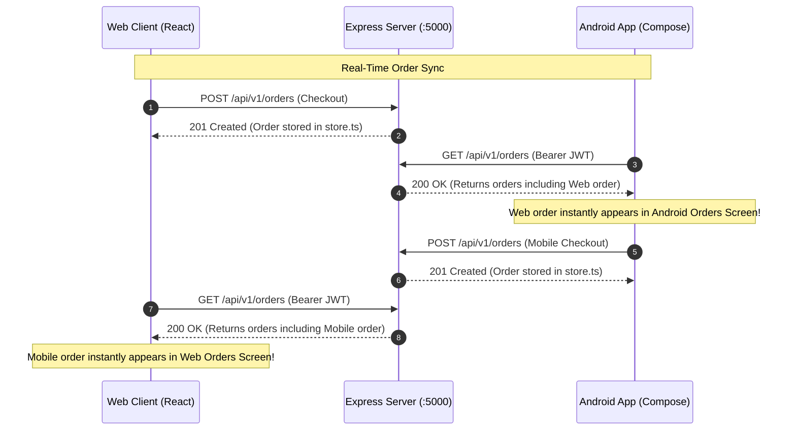

# AGENTS.md: ITFreeSource Academy Book Store Context Guide

This repository contains the **ITFreeSource Academy Book Store**, an enterprise-grade fullstack TypeScript & Android platform engineered as a realistic e-commerce application and a rich test automation workbench for QA engineers, SDETs, and automated testing frameworks (Playwright, Cypress, Vitest, Appium).

---

## 🏛️ System Architecture & Tech Stack

- **Frontend (Web)**: React 19 Single Page Application (SPA), Vite 6, Tailwind CSS 3.4, Lucide React icons, React Router v7.
- **Backend (API)**: Node.js (v20+ / v22+), Express.js 4.21, TypeScript 5.8 (`server/src/index.ts`).
- **Companion Mobile App**: Native Android companion app in `android/` (Kotlin 2.2, Jetpack Compose, Material Design, AGP 9.3, Gradle 9.5, API 34).
- **Database & State**: In-memory state store (`server/src/data/store.ts`) seeded with 25+ books, 11 personas, reviews, orders, rentals, and audit logs.
- **API Documentation**: OpenAPI 3.0 via `swagger-ui-express` served at `/api/swagger` (raw JSON at `/api/swagger.json`).
- **Event Streaming & Webhooks**: In-memory Kafka broker (`server/src/services/kafkaBroker.ts`) and HMAC webhook dispatcher (`server/src/services/webhookService.ts`).
- **Test Engine**: Vitest 5 with v8 coverage provider (`@vitest/coverage-v8`), Supertest for HTTP integration tests.
- **CI/CD & Deployment**: 
  - GitHub Actions workflow at `.github/workflows/ci.yml`.
  - Cloudflare Pages / Workers deployment via `wrangler.jsonc` (project name `bookstore`) deploying static SPA assets from `./dist` with SPA routing fallback.

---

## 📜 CRITICAL AGENT RULES: Web-to-Mobile Feature Parity Protocol

All AI agents and developers working on this repository **MUST ALWAYS FOLLOW** these rules to maintain strict parity between the Web application and the Native Android companion app:

### Rule 1: Single Source of Truth (The REST API)
- The Express backend (`server/src/routes/`) is the central source of truth for both Web and Mobile.
- Whenever a new endpoint, query parameter, or JSON response field is created or modified in `server/`, you **MUST** update:
  1. The TypeScript schemas in `server/src/types/index.ts` and `client/src/types/`.
  2. The Kotlin data models in `android/app/src/main/java/com/itfreesource/bookstore/model/Models.kt`.
  3. The Android REST client in `android/app/src/main/java/com/itfreesource/bookstore/data/ApiClient.kt`.

### Rule 2: Web Feature = Mobile Feature Parity
- **Never implement a customer-facing feature on the Web without implementing its equivalent on Android.**
- When you add or change:
  - Catalog filters, search logic, or category browsing $\rightarrow$ update `client/src/pages/HomePage.tsx` and `android/.../ui/screens/CatalogScreen.kt`.
  - Cart, promotion codes (`SAVE10`, `SAVE20`, `FREESHIP`), VIP discounts, or multi-step checkout $\rightarrow$ update `client/src/pages/CartPage.tsx` and `android/.../ui/screens/CartCheckoutScreen.kt`.
  - Order status transitions, tracking numbers, or refunds $\rightarrow$ update `client/src/pages/OrdersPage.tsx` and `android/.../ui/screens/OrdersScreen.kt`.
  - Academic rentals (10-day loan, overdue fines, lost replacement) $\rightarrow$ update `client/src/pages/BorrowedBooksPage.tsx` and `android/.../ui/screens/RentalsScreen.kt`.
  - Admin/Store Manager management tools $\rightarrow$ update `client/src/pages/ManagementPage.tsx` and `android/.../ui/screens/ManagementScreen.kt`.

### Rule 3: Real-Time Transactional Synchronization & Full API Consumption
- **Both Web and Mobile consume the EXACT same Express REST APIs:**
  | Resource | Method & Endpoint | Web Page | Android Compose Equivalent |
  | :--- | :--- | :--- | :--- |
  | **Auth / Login** | `POST /api/v1/auth/login` | `AuthContext.tsx` | `ApiClient.login(...)` |
  | **Current User Profile** | `GET /api/v1/auth/me` | `AuthContext.tsx` | `ApiClient.fetchCurrentUser()` |
  | **User Management** | `GET /api/v1/auth/users` | `UsersPage.tsx` | `ApiClient.fetchUsers()` |
  | **Update User Profile** | `PUT /api/v1/auth/users/:id` | `UsersPage.tsx` | `ApiClient.updateUser(...)` |
  | **User Status (Suspend)** | `PATCH /api/v1/auth/users/:id/status` | `UsersPage.tsx` | `ApiClient.updateUserStatus(...)` |
  | **Books Catalog** | `GET /api/v1/books` | `BooksCatalogPage.tsx` | `ApiClient.fetchBooks()` |
  | **Categories** | `GET /api/v1/categories` | `BooksCatalogPage.tsx` | `ApiClient.fetchCategories()` |
  | **Authors** | `GET /api/v1/authors` | `BooksCatalogPage.tsx` | `ApiClient.fetchAuthors()` |
  | **Orders List** | `GET /api/v1/orders` | `OrdersPage.tsx` | `ApiClient.fetchOrders()` |
  | **Place Order (Checkout)** | `POST /api/v1/orders` | `CartCheckoutPage.tsx`| `ApiClient.postOrder(...)` |
  | **Order Status & Tracking** | `PATCH /api/v1/orders/:id/status` | `OrdersPage.tsx` | `ApiClient.updateOrderStatus(...)` |
  | **Cancel Order** | `POST /api/v1/orders/:id/cancel` | `OrdersPage.tsx` | `ApiClient.cancelOrder(...)` |
  | **Refund Order** | `POST /api/v1/orders/:id/refund` | `OrdersPage.tsx` | `ApiClient.refundOrder(...)` |
  | **Academic Borrow List** | `GET /api/v1/borrow` | `BorrowedBooksPage.tsx` | `ApiClient.fetchBorrowRecords()` |
  | **Borrow Book (Loan)** | `POST /api/v1/borrow` | `BorrowedBooksPage.tsx` | `ApiClient.borrowBook(...)` |
  | **Return Book** | `POST /api/v1/borrow/:id/return` | `BorrowedBooksPage.tsx` | `ApiClient.returnBook(...)` |
  | **Report Lost Book** | `POST /api/v1/borrow/:id/lost` | `BorrowedBooksPage.tsx` | `ApiClient.reportBookLost(...)` |
  | **Reviews List** | `GET /api/v1/reviews` | `ReviewsPage.tsx` | `ApiClient.fetchReviews(...)` |
  | **Submit Review** | `POST /api/v1/reviews` | `BookDetailPage.tsx` | `ApiClient.submitReview(...)` |
  | **Moderate Review** | `PATCH /api/v1/reviews/:id/status` | `ReviewsPage.tsx` | `ApiClient.moderateReview(...)` |
  | **Stock Adjustment** | `PATCH /api/v1/inventory/:id/stock` | `InventoryPage.tsx` | `ApiClient.updateStock(...)` |
  | **Audit Logs** | `GET /api/v1/audit-logs` | `AuditLogsPage.tsx` | `ApiClient.fetchAuditLogs()` |
  | **System DB Reset** | `POST /api/v1/system/reset` | `Navbar.tsx` / `Playground` | `ApiClient.resetSystem()` |
  | **Latency Simulation** | `POST /api/v1/system/latency` | `PlaygroundPage.tsx` | `ApiClient.setSimulatedLatency(...)` |

- **Fallback / Standalone Mode:**
  - If the backend is offline or unreachable, the Android app gracefully falls back to local reactive mock state seeded by `SeedData.kt`. It must never crash.

### Rule 4: Appium Automation Standards (Separate Test Repo)
- **Do NOT add test suites into `android/`**: The user maintains end-to-end Appium automated test suites in a separate repository.
- **Semantic Locators**: Every interactive Android component must provide a semantic accessibility locator via `Modifier.semantics { contentDescription = repo.getTestId("<locator_id>") }`.
- Follow consistent naming conventions matching web `data-testid` attributes:
  - Buttons: `btn_place_order`, `btn_sync_orders`, `btn_reset_database_seed`, `btn_borrow_book`
  - Inputs: `input_search_books`, `input_shipping_fullname`, `input_backend_api_url`
  - Cards & Rows: `book_card_<id>`, `order_card_<orderNumber>`
  - Navigation: `nav_catalog`, `nav_cart`, `nav_orders`, `nav_rentals`, `nav_sandbox`, `nav_management`

### Rule 5: Cloudflare Deployment Integrity
- The root `package.json` workspaces list **MUST ONLY** contain `["server", "client"]`. Never add `android` to npm workspaces.
- Cloudflare Pages / Workers builds run `npm run build` which outputs to `./dist`. The `android/` directory must have zero impact on this process.
- `android/.gitignore` must strictly ignore all build caches (`.gradle/`, `build/`, `app/build/`, `*.apk`, `*.aab`, `local.properties`).

---

## 👥 11 User Personas & Test Matrix

Both Web and Android feature a sticky 1-click persona switcher across all 11 roles:

| Username | Password | Role | Currency | Timezone | Permissions / Test Focus |
| :--- | :--- | :--- | :---: | :--- | :--- |
| `admin` | `Admin@Pass123` | `admin` | USD ($) | `America/New_York` | Full system access, user management, audit logs, inventory updates |
| `store_manager` | `Manager@Pass123` | `store_manager` | USD ($) | `America/New_York` | Catalog management, pricing updates, order status management |
| `dubai_shopper` | `Dubai@Pass123` | `standard_customer` | AED (AED) | `Asia/Dubai` | Regional currency/timezone conversions, book borrowing & penalties |
| `tokyo_reader` | `Tokyo@Pass123` | `standard_customer` | JPY (¥) | `Asia/Tokyo` | Zero-decimal currency exchange (JPY 155), timezone calculations |
| `mumbai_borrower`| `Mumbai@Pass123` | `standard_customer` | INR (₹) | `Asia/Kolkata` | High-frequency book borrowing, rental fee simulation |
| `sydney_collector`| `Sydney@Pass123`| `standard_customer` | AUD (A$) | `Australia/Sydney` | Australian dollar pricing, international order placement |
| `standard_customer`| `User@Pass123` | `standard_customer` | USD ($) | `America/New_York` | Standard purchasing, cart checkout, reviews submission |
| `vip_customer` | `Vip@Pass123` | `vip_customer` | USD ($) | `America/New_York` | Automatic 20% discount on cart subtotal, VIP exclusive catalog |
| `order_fulfillment`| `Fulfill@Pass123` | `order_fulfillment` | USD ($) | `America/New_York` | Order fulfillment, tracking number assignment, status pipeline |
| `support_agent` | `Support@Pass123` | `support_agent` | USD ($) | `America/New_York` | Customer support, order cancellations, refund processing |
| `suspended_user` | `Suspended@Pass123`| `standard_customer` (suspended) | USD ($) | `America/New_York` | Account suspension testing (403 Forbidden on actions) |

---

## 🚀 How to Run & Build

### Web & API (Concurrent Development)
```bash
npm run dev              # Frontend on http://localhost:5173, Backend on http://localhost:5000
npm run build            # Production build: compiles server & client to ./dist (Cloudflare target)
npm start                # Unified server on http://localhost:5000
npm test                 # Vitest test suites (auth, borrow, api, store)
```

### Native Android Companion App
The native Android project is located directly in `android/`:
```bash
cd android
# Build Debug APK (ideal for local testing and Appium automation)
JAVA_HOME=/opt/android-studio/jbr ANDROID_HOME=/home/virus/Android/Sdk ./gradlew assembleDebug

# Build Production Google Play Signed Bundle & Release APK
JAVA_HOME=/opt/android-studio/jbr ANDROID_HOME=/home/virus/Android/Sdk ./gradlew assembleRelease bundleRelease
```

- **Debug APK**: `android/app/build/outputs/apk/debug/app-debug.apk`
- **Release APK**: `android/app/build/outputs/apk/release/app-release.apk`
- **Google Play Bundle**: `android/app/build/outputs/bundle/release/app-release.aab`
- **Application ID**: `com.itfreesource.bookstore`
- **Main Activity**: `com.itfreesource.bookstore.MainActivity`
- **Target SDK**: Android API 34 (Android 14) | **Min SDK**: 24 (Android 7.0+)
- **Signing Keystore**: `android/app/release.jks` (alias `bookstore_release`, pass `StorePass2026!`)

---

## 🔄 Live Data Synchronization Flow



---

## 🛠️ Appium Capabilities Reference

For the external Appium test repository, use the following configuration:

```python
from appium import webdriver
from appium.options.android import UiAutomator2Options

options = UiAutomator2Options()
options.platform_name = "Android"
options.automation_name = "UiAutomator2"
options.device_name = "Android Emulator"
options.app_package = "com.itfreesource.bookstore"
options.app_activity = "com.itfreesource.bookstore.MainActivity"
options.app = "/path/to/itfreesource-academy-book-store/android/app/build/outputs/apk/debug/app-debug.apk"
options.no_reset = False
options.auto_grant_permissions = True
```
