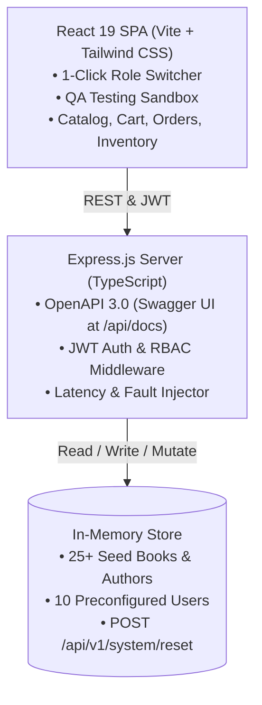

# 📚 ITFreeSource Academy - Book Store Platform

[](https://www.typescriptlang.org/)
[](https://react.dev/)
[](https://nodejs.org/)
[](https://expressjs.com/)
[](http://localhost:5000/api/docs)
[](https://vitejs.dev/)
[](https://tailwindcss.com/)
[](https://www.docker.com/)
[](https://github.com/itfreesource-academy/itfreesource-academy-book-store/actions)

A fullstack **TypeScript Book Store platform**, single-page React SPA, and automated testing workbench designed for public demonstration on LinkedIn and real-world QA test engineering (Playwright, Cypress, Selenium, Appium, RestAssured, Postman/Newman).

Repository: [github.com/itfreesource-academy/itfreesource-academy-book-store](https://github.com/itfreesource-academy/itfreesource-academy-book-store)

---

## 🚀 Key Highlights & Architecture



- **Interactive Swagger 3.0 Documentation**: Live at `http://localhost:5000/api/docs` with downloadable `openapi.json`.
- **10 Distinct User Personas & RBAC**: Granular permissions controlling navigation, action buttons, pricing edits, order status transitions, review moderation, and audit trails.
- **Top Sticky QA Switcher**: Instant 1-click login as any of the 10 roles without manual typing.
- **Dedicated QA Testing Sandbox (`/playground`)**: Dynamic vs. Static `data-testid` toggle, artificial network latency slider (0ms - 5000ms), HTTP error fault triggers (400, 401, 403, 404, 429, 500, 503), Shadow DOM encapsulation, iFrame sandbox, native browser dialogs, and HTML5 Drag-and-Drop.
- **Instant Test Database Reset**: `POST /api/v1/system/reset` restores all books, orders, inventory, and reviews back to initial seed data on-demand.

---

## 🔑 10 Preconfigured Personas & Credentials Matrix

Every account comes pre-configured with distinct role permissions and real-world behavior:

| # | Username | Password | Role | Visible Scope & Testing Capabilities |
|---|---|---|---|---|
| 1 | `admin` | `Admin@Pass123` | **Super Admin** | Full CRUD on books, categories, authors, users, audit logs, price modifications, system reset |
| 2 | `store_manager` | `Manager@Pass123` | **Store Manager** | Catalog CRUD, pricing edits, view all customer orders, review moderation; cannot manage users |
| 3 | `inventory_clerk` | `Stock@Pass123` | **Inventory Specialist** | Warehouse stock sliders, batch stock updates, low-stock threshold alerts; pricing is read-only |
| 4 | `content_editor` | `Editor@Pass123` | **Content Editor** | Edit book descriptions, upload cover images, update blog/topic tags; cannot delete or modify prices |
| 5 | `order_fulfillment` | `Orders@Pass123` | **Order Fulfillment** | View all orders, update shipping tracking numbers & statuses (Processing &rarr; Shipped &rarr; Delivered) |
| 6 | `support_agent` | `Support@Pass123` | **Customer Support** | View customer orders, issue full refunds, handle customer returns, read-only catalog access |
| 7 | `book_reviewer` | `Reviewer@Pass123` | **Lead Reviewer** | Review moderation queue (Approve/Reject), publish verified critiques with star ratings |
| 8 | `auditor` | `Audit@Pass123` | **Compliance Auditor** | Read-only access to Audit Logs, security events, financial stats, system activity; 0 write actions |
| 9 | `vip_customer` | `Vip@Pass123` | **VIP Customer** | Automatic 20% discount on cart/checkout, access to VIP-exclusive collector titles, personal orders |
| 10 | `standard_customer` | `User@Pass123` | **Regular Customer** | Standard catalog browsing, shopping cart, multi-step checkout, view own order history |

---

## 🧪 Comprehensive Testable UI Elements

Every component has explicit `data-testid` attributes and semantic HTML:

1. **Dynamic Breadcrumbs**: Hierarchical trail (e.g. `Home > Catalog > Science Fiction > Dune`) with clickable links.
2. **Calendars & Date Pickers**:
   - Single date picker with past-date validation for book publication dates.
   - Date range picker (`DateRangePicker`) with quick presets (*Today*, *Last 7 Days*, *Last 30 Days*).
   - Expected delivery date estimator on checkout.
3. **Sliders & Range Controls**:
   - Dual-thumb price range slider ($0 - $120).
   - Star rating threshold slider (1.0 - 5.0).
   - Warehouse stock adjustment sliders with real-time sync.
   - Network latency simulation slider (0ms - 5000ms).
4. **Dropdowns & Comboboxes**:
   - Custom searchable combobox with instant filtering.
   - Multi-select genre/tag chips with single-click remove buttons.
   - Bulk actions menu (Export JSON, Bulk Delete).
5. **Carousels & Swipers**:
   - Featured Bestsellers hero carousel with autoplay toggle, next/prev arrows, and indicator dots.
6. **Data Tables & Pagination**:
   - Sortable columns (Title, Price, Rating, Stock).
   - "Select All" checkbox with indeterminate state handling.
   - Page size dropdown (6, 12, 24) and numbered page navigation.
7. **Modals & Drawers**:
   - Add/Edit Book modal with full form validation and image preview.
   - Slide-over Shopping Cart drawer accessible from any page.
   - Order details modal and status transition dialog.
8. **QA Automation Sandbox (`/playground`)**:
   - Toggle between Static and Dynamic IDs.
   - Shadow DOM piercing test element.
   - Isolated iFrame sandbox.
   - HTML5 Drag-and-Drop priority reordering.
   - Native browser dialogs (`window.alert()`, `window.confirm()`, `window.prompt()`).

---

## 💻 Quickstart & Local Setup

### Prerequisites
- Node.js (v20+ or v22+)
- npm (v10+)

### 1. Installation
```bash
# Clone the repository
git clone https://github.com/itfreesource-academy/itfreesource-academy-book-store.git
cd itfreesource-academy-book-store

# Install all dependencies (root, server, client)
npm run install:all
```

### 2. Development Mode
Run both frontend and backend concurrently:
```bash
npm run dev
```
- Frontend SPA: `http://localhost:5173`
- Backend REST API: `http://localhost:5000`
- Swagger UI Documentation: `http://localhost:5000/api/docs`

### 3. Production Build & Run
```bash
npm run build
npm start
```
*Note: The Express server serves both the React SPA and REST API together on port `5000`.*

### 4. Run with Docker
```bash
docker-compose up --build
```

---

## 🤖 Playwright Test Example

```typescript
import { test, expect } from '@playwright/test';

test.describe('Book Store QA Automation Test Suite', () => {
  test.beforeEach(async ({ page }) => {
    // Reset test database to initial clean seed state
    await page.request.post('http://localhost:5000/api/v1/system/reset');
    await page.goto('http://localhost:5173');
  });

  test('RBAC: Super Admin can access User Management & Catalog CRUD', async ({ page }) => {
    // 1-Click login as admin via top persona switcher
    await page.click('[data-testid="quick-persona-btn-admin"]');
    await expect(page.locator('[data-testid="active-persona-role"]')).toHaveText('admin');

    // Verify admin navigation items
    await expect(page.locator('[data-testid="nav-link-users"]')).toBeVisible();
    await expect(page.locator('[data-testid="nav-link-audit"]')).toBeVisible();
  });

  test('RBAC: Standard Customer cannot access Admin pages', async ({ page }) => {
    await page.click('[data-testid="quick-persona-btn-standard_customer"]');
    await expect(page.locator('[data-testid="active-persona-role"]')).toHaveText('standard_customer');

    // Admin links must not exist
    await expect(page.locator('[data-testid="nav-link-users"]')).not.toBeVisible();
    await expect(page.locator('[data-testid="nav-link-audit"]')).not.toBeVisible();
  });

  test('Filter catalog using Dual-Range Price Slider', async ({ page }) => {
    await page.goto('http://localhost:5173/books');
    const priceSlider = page.locator('[data-testid="filter-price-slider-max-input"]');
    await priceSlider.fill('35');
    await expect(page.locator('[data-testid="filter-price-slider-value"]')).toContainText('$35');
  });

  test('Shadow DOM Piercing Automation', async ({ page }) => {
    await page.goto('http://localhost:5173/playground');
    const shadowInput = page.locator('#shadow-host').locator('#shadow-input');
    await shadowInput.fill('Playwright Shadow DOM Test');
    await page.locator('#shadow-host').locator('#shadow-submit-btn').click();
    await expect(page.locator('#shadow-host').locator('#shadow-output')).toContainText('Playwright Shadow DOM Test');
  });
});
```

---

## 📡 REST API Endpoints Overview

| Method | Endpoint | Description | Protected Role |
|---|---|---|---|
| `POST` | `/api/v1/auth/login` | Authenticate with credentials & get JWT | Public |
| `GET` | `/api/v1/auth/me` | Current user profile & permissions | Any Authenticated |
| `GET` | `/api/v1/auth/users` | List all 10 test personas | Public |
| `PATCH` | `/api/v1/auth/users/:id/status` | Suspend or activate user | `admin` |
| `GET` | `/api/v1/books` | Filter & paginate books | Public |
| `POST` | `/api/v1/books` | Create a new book | `admin`, `store_manager`, `content_editor` |
| `PUT` | `/api/v1/books/:id` | Update book details | `catalog:update` |
| `DELETE` | `/api/v1/books/:id` | Delete book | `admin` |
| `GET` | `/api/v1/orders` | List user orders or all orders | Authenticated |
| `POST` | `/api/v1/orders` | Place new order (calculates VIP discount) | Authenticated |
| `PATCH` | `/api/v1/orders/:id/status` | Transition order status | `order_fulfillment`, `admin` |
| `POST` | `/api/v1/orders/:id/refund` | Issue customer refund | `support_agent`, `admin` |
| `GET` | `/api/v1/inventory` | Warehouse inventory & stock count | `inventory:read` |
| `PATCH` | `/api/v1/inventory/:id/stock` | Adjust stock level | `inventory:update` |
| `GET` | `/api/v1/reviews` | List book reviews or moderation queue | Public |
| `PATCH` | `/api/v1/reviews/:id/status` | Approve or reject review | `book_reviewer`, `admin` |
| `GET` | `/api/v1/audit-logs` | Retrieve system audit logs | `auditor`, `admin` |
| `POST` | `/api/v1/system/reset` | Restore test DB back to initial seeds | Public / QA |
| `POST` | `/api/v1/system/latency` | Configure artificial delay (ms) | Public / QA |
| `GET` | `/api/v1/system/simulate-error` | Trigger simulated HTTP status (400-503) | Public / QA |

---

## 👥 Contributors & License

Developed with ❤️ by **ITFreeSource Academy**.  
Distributed under the **MIT License**.
